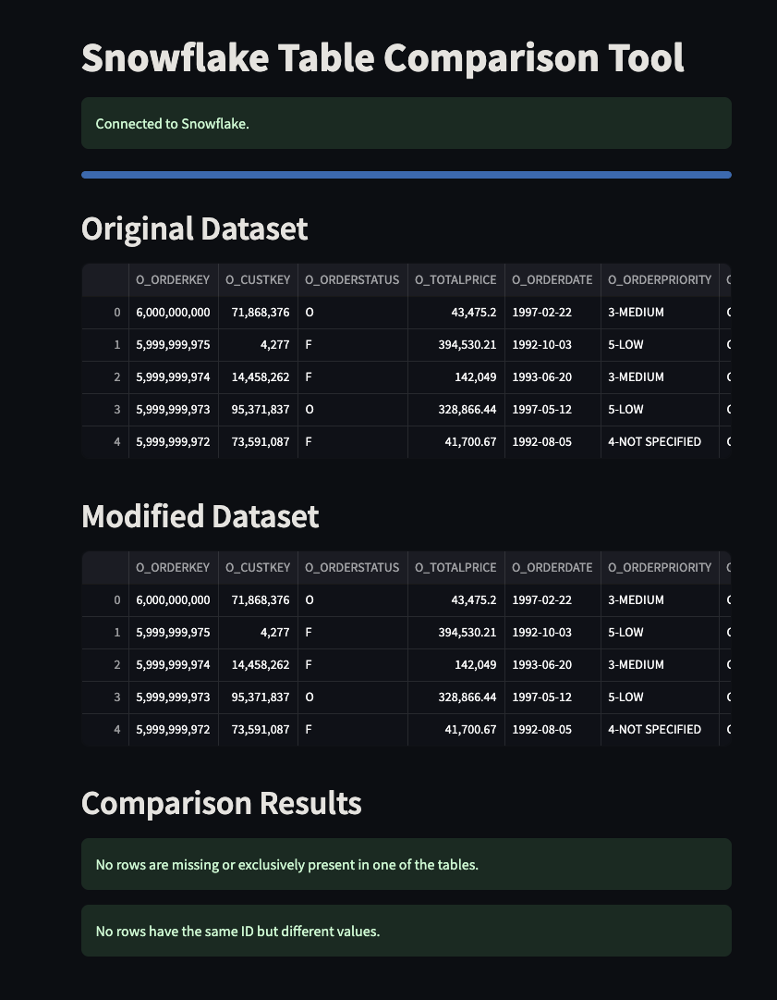
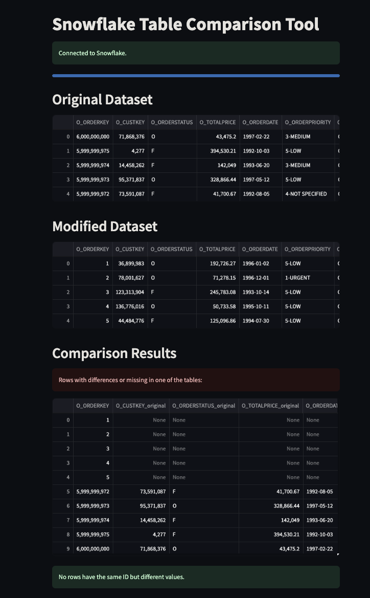

# Snowflake Table Comparison
[](https://snow-table-comparison.streamlit.app/)

[](https://python.org/)
[](https://snowflake.com/)
[](https://streamlit.io/)

This project contains a Streamlit app for comparing two tables in Snowflake to identify differences in rows and columns. It uses Snowflake's external browser-based authentication to securely access the data.

## Setup Instructions

### Creating a Virtual Environment

```bash
python3 -m venv venv && source venv/bin/activate && pip3 install --upgrade pip && pip3 install -r requirements.txt 
```

### Running the Streamlit App

```bash
streamlit run app.py
```

## Examples (Snowflake Sample Data DB)
### Example 1 

### Example 2


